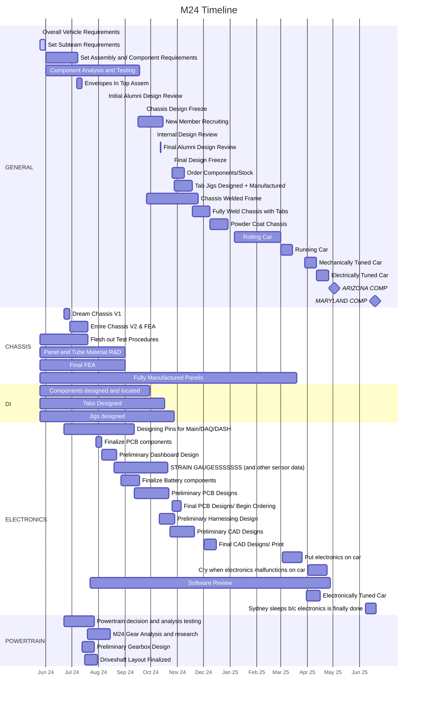

## Project Timeline

```mermaid
gantt
title M24 Timeline
dateFormat  YYYY-MM-DD
axisFormat  %b %y

section GENERAL
Overall Vehicle Requirements :done, after, 2024-05-25, 2024-05-25
Set Subteam Requirements :active, after, 2024-05-25, 2024-05-31
Set Assembly and Component Requirements :after, 2024-06-01, 2024-07-08
Component Analysis and Testing :after, 2024-06-01, 2024-09-18
Envelopes In Top Assem :after, 2024-07-07, 2024-07-13
Initial Alumni Design Review :after, 2024-08-10, 2024-08-10
Chassis Design Freeze :after, 2024-09-23, 2024-09-23
New Member Recruiting :after, 2024-09-16, 2024-10-15
Internal Design Review :after, 2024-10-05, 2024-10-05
Final Alumni Design Review :after, 2024-10-12, 2024-10-13
Final Design Freeze :after, 2024-10-25, 2024-10-25
Order Components/Stock :after, 2024-10-26, 2024-11-09
Tab Jigs Designed + Manufactured :after, 2024-10-28, 2024-11-18
Chassis Welded Frame :after, 2024-09-26, 2024-11-25
Fully Weld Chassis with Tabs :after, 2024-11-18, 2024-12-09
Powder Coat Chassis :after, 2024-12-09, 2024-12-30
Rolling Car :after, 2025-01-06, 2025-03-01
Running Car :after, 2025-03-01, 2025-03-15
Mechanically Tuned Car :after, 2025-03-29, 2025-04-12
Electrically Tuned Car :after, 2025-04-12, 2025-04-26
ARIZONA COMP : milestone, after, 2025-05-01, 2025-05-04
MARYLAND COMP : milestone, after, 2025-06-16, 2025-06-22

section CHASSIS
Dream Chassis V1 :after, 2024-06-22, 2024-06-29
Entire Chassis V2 & FEA :after, 2024-06-29, 2024-07-20
Flesh out Test Procedures :after, 2024-05-25, 2024-07-20
Panel and Tube Material R&D :after, 2024-05-25, 2024-09-01
Final FEA :after, 2024-05-25, 2024-09-01
Fully Manufactured Panels :after, 2024-05-25, 2025-03-20

section DI
Components designed and located :after, 2024-05-25, 2024-09-30
Tabs Designed :after, 2024-05-25, 2024-10-17
Jigs designed :after, 2024-05-25, 2024-10-28

section ELECTRONICS
Designing Pins for Main/DAQ/DASH :after, 2024-06-22, 2024-09-12
Finalize PCB components :after, 2024-07-29, 2024-08-05
Preliminary Dashboard Design :after, 2024-08-05, 2024-08-22
STRAIN GAUGESSSSSSS (and other sensor data) :after, 2024-08-19, 2024-10-21
Finalize Battery components :after, 2024-08-27, 2024-09-18
Preliminary PCB Designs :after, 2024-09-12, 2024-10-22
Final PCB Designs/ Begin Ordering :after, 2024-10-26, 2024-11-05
Preliminary Harnessing Design :after, 2024-10-11, 2024-10-29
Preliminary CAD Designs :after, 2024-10-23, 2024-11-21
Final CAD Designs/ Print :after, 2024-12-02, 2024-12-16
Put electronics on car :after, 2025-03-03, 2025-03-26
Cry when electronics malfunctions on car :after, 2025-04-02, 2025-04-24
Software Review :after, 2024-07-22, 2025-04-28
Electronically Tuned Car :after, 2025-03-31, 2025-04-16
Sydney sleeps b/c electronics is finally done :after, 2025-06-08, 2025-06-20

section POWERTRAIN
Powertrain decision and analysis testing :after, 2024-06-22, 2024-07-27
M24 Gear Analysis and research :after, 2024-07-19, 2024-08-15
Preliminary Gearbox Design :after, 2024-07-13, 2024-07-27
Driveshaft Layout Finalized :after, 2024-07-16, 2024-07-31

```
